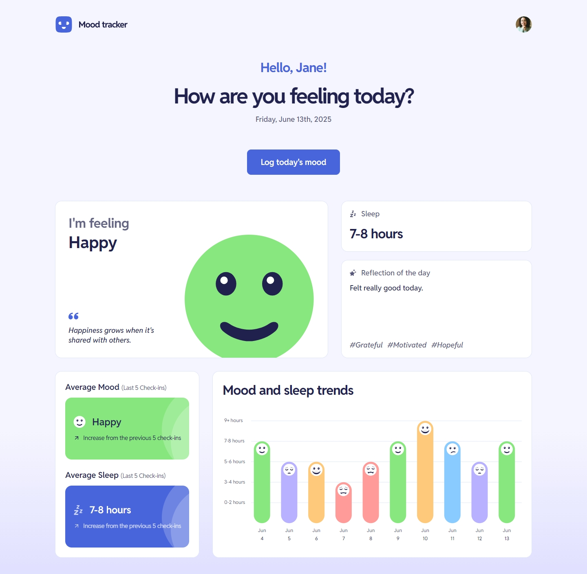
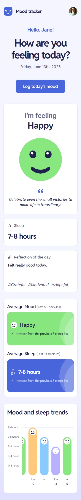

## Frontend Mentor Challenge 32 - Mood Tracking App

This is my solution to the [Mood Tracking App](https://www.frontendmentor.io/challenges/mood-tracking-app-E2XeKhDF0B) challenge on [Frontend Mentor](https://www.frontendmentor.io/).

#

### Links 🔗

- Live Site URL: https://mood-tracker-darkstar.vercel.app/

#

### Built with 🔨

- Next.js
- TypeScript
- Tailwind
- Prisma ORM
- React Aria Components
- Motion
- React Hook Form
- Zod
- D3
- Supabase (Postgres)
- Cloudinary

#

### Features ✨

- **User authentication** with session management using JWTs.
- **Daily mood logging** including feelings, sleep duration, and reflection.
- **Today’s entry summary** displaying the mood, sleep, and note logged for the current day.
- **Trend comparison** showing average mood and sleep from the last 5 entries, along with how they compare to the previous 5 entries.
- **Bar chart visualization** of mood and sleep patterns over time.
- **Profile management** with support for updating name and avatar.

#

### Technical Details 🔧

#### Authentication

- For login and signup forms I follow a simple pattern using React Hook Form (RHF) and Zod. I create a Zod schema for auth (in this project I maintained two schemas, one for login and one for signup) and use that schema to validate the data on both the client and the server. `zodResolver` from `@hookform/resolvers` lets RHF use the Zod schema for validation.
- One downside of this RHF pattern is, I don’t have a proper way to utilize the `action` prop of the form. RHF sends the validated data using a submit handler. Since the `action` is not used I also lose the ability to use `useActionState`. This also makes me handle the loading states manually.
- Once the client side validation passes data is sent to a server action. On the server action I again validate the data using the same Zod schema. For signup, the password is hashed and saved along the email to the database via Prisma. Whether the email already exists is checked at this step and if so, an error message is returned to the client. If database entry succeeds, the JWT creation functions are called and a session is created. I only store the `userId` inside the JWT. The token is then stored in a cookie from the server side as a `httpOnly` cookie.
- For login, when the form data hits the server, the incoming password will get compared against the hashed password from the database using `bcrypt.compare()`. If successful, a session is created storing the `userId` as the payload.

#### Data Access, Error Handling and Middleware

- Each request goes through a middleware check, which grabs the cookie from the incoming request, extracts the token, call the token verify function to verify the session. If the user is trying to access a non-public route while unauthorized (token verification failed), user will be redirected to `/login`. Only `/login` and `/signup` are public routes.
- Inside the app, all data fetching happens in server components. I always keep the `page.tsx` for each route, as a server component. All the data needed for that route will be fetched inside it and will be passed down to the components. In this project, for the root route (`/`) I fetched the data in the server component and then used React Context on the very first client child component because the root route had many layers of components that needed access to the fetched data. Otherwise I would generally just use props to pass the fetched data from the `page.tsx` server component to the child components.
- All POST requests (database updates) happen using server actions. User profile update and creating new mood entries have client side validation avoiding any network requests to the server if data is in an invalid shape.
- Each database call (fetching mood data, creating new mood entries, updating user profile data etc.) happen through functions from the `data-access-layer`. Each function in data access layer, verifies the session before executing the rest of the function and if verification fails, it will redirect the user to `/login`.
- For POST requests I return error messages to the client in a consistently formatted shape, which are then rendered in the UI. For GET request errors (e.g. a Prisma error) it is set up to be thrown and caught by the error boundary.

#### UI and Components

- I used React Aria Components, which is headless, for components like Radio Group, Modal, Menu etc.
- Added some small animations using Motion (formerly Framer Motion). They are present in many places across the app. Radio buttons, checkboxes, loading and success states, multi step form transitions etc.
- Chart was done using D3. I initially did it using Recharts (which uses D3 under the hood) but I didn’t like the result I got, both UI wise and code wise. Going a level deep and doing everything with D3 and Motion gave the result I was looking for. Also it was more fun than working with the abstraction Recharts gave.

#

### Screenshots of the Solution (Desktop & Mobile) 🔍

#

- My Frontend Mentor profile - [@DarkstarXDD](https://www.frontendmentor.io/profile/DarkstarXDD)
